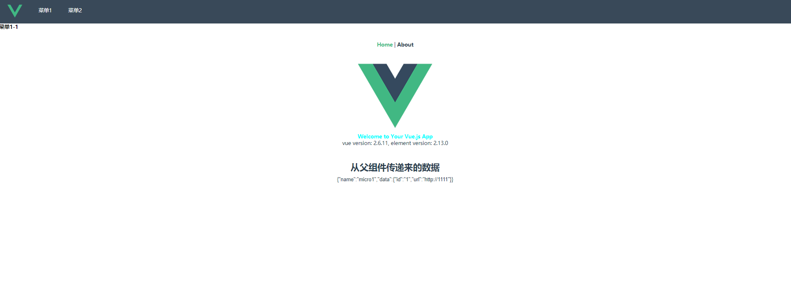

***\* vue-cli-plugin-qiankun\****

> An Vue-cli3 Plugin for micro-frontend qiankun application

结合 qiankun 快速生成微前端应用的脚手架插件


## Features

- qiankun 接入，子应用打包配置接入

- 修改 qiankun 官网 demo 中 vue 子应用 public 下静态资源加载不出来的问题

- 主应用和子应用中基础的路由处理

- IE下的兼容显示，关闭jsSandbox(待完善)

  

## Demo




## Setup

主应用生成方式

```javascript
ue create portal-demo

cd portal-demo

npm install --save-dev file:../vue-cli-plugin-qiankun/vue-cli-plugin-qiankun-portal

vue invoke vue-cli-plugin-qiankun-portal
```

子应用生成方式

```javascript
vue create micro-app-demo

cd micro-app-demo

npm install --save-dev file:../vue-cli-plugin-qiankun/vue-cli-plugin-qiankun-microapp

vue invoke vue-cli-plugin-qiankun-microapp
```


## Inspired

- [qiankun](https://github.com/umijs/qiankun)
- [vue-cli-plugin-qiankun](https://github.com/F-loat/vue-cli-plugin-qiankun)